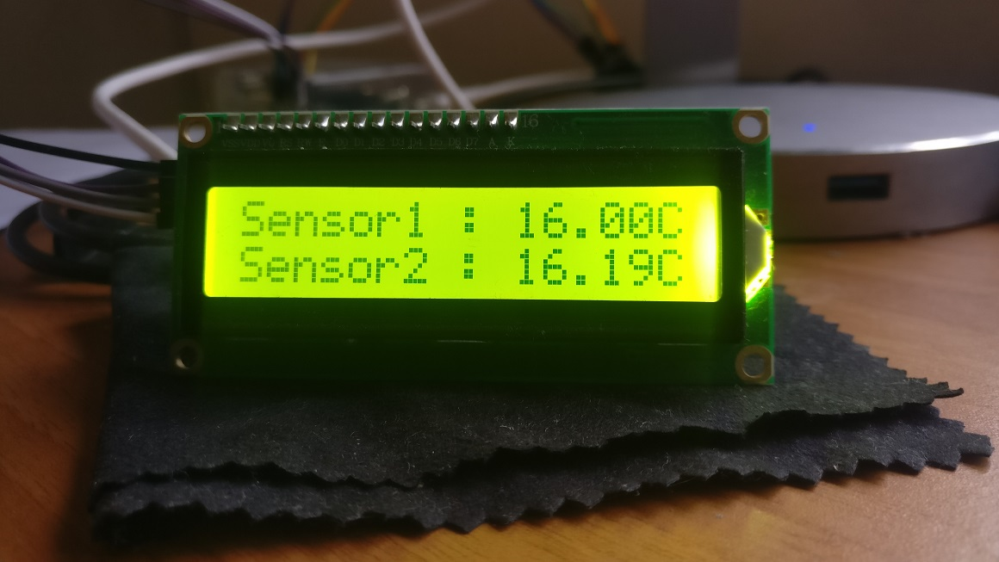

# DS18B20Reader - A sample code to read temperature from a DS18B20 sensor and output it to an LCD1602

Requirements:
  1) Raspberry Pi (any flavour)
  
  2) DS18B20 Sensor - https://www.aliexpress.com/item/DS18B20-Temperature-Sensor-Module-Kit-Waterproof-100CM-Digital-Sensor-Cable-Stainless-Steel-Probe-Terminal-Adapter-For/32839776524.html
  
  3) Configure the DS18B20 to work with your Raspberry Pi: https://albertherd.com/2019/01/02/connecting-a-ds18b20-thermal-sensor-to-your-raspberry-pi-raspberry-pi-temperature-monitoring-part-1/
  
  4) Configure the LCD1602 to work with your Raspberry Pi: https://albertherd.com/2019/01/12/connecting-a-lcd1602-with-an-i2c-module-to-your-raspberry-pi-raspberry-pi-temperature-monitoring-part-2/
  
  5) Learn how to capture readings from your DS18B20 sensor: https://albertherd.com/2019/01/20/using-c-to-monitor-temperatures-through-your-ds18b20-thermal-sensor-raspberry-pi-temperature-monitoring-part-3/
  
  6) Learn how to output readings to your LCD1602: https://albertherd.com/2019/02/02/outputting-ds18b20-temperatures-on-a-lcd1602-raspberry-pi-temperature-monitoring-part-4/
  
  7) Hard mode! Don't follow steps 3-6 and spend hours trying to figure stuff out :)
  
  8) Clone the repostiory
  
  7) cmake . && make && ./DS18B20Reader "Sensor"
  
  8) Enjoy!
